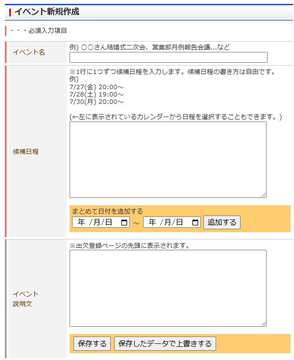

# 伝助+

v1.0

## 導入の仕方

1. githubのページより、右上緑のボタン「Code」をクリック、「Download ZIP」でダウンロード
   - ※左上の文字が「main」となっていることを確認してください。
  
2. ダウンロードしたZIPファイルを任意の場所で解凍
3. ブラウザの右上の設定から、「拡張機能>拡張機能を管理」を選択
  
4. デベロッパーモードがOFFになっているならONにする
5. 「パッケージ化されていない拡張機能を読み込む」をクリックし、手順2で解凍したファイルを選択
   ※選択したファイル直下にmanifestファイルが入っているようにする

## 内容

※追加箇所はオレンジになっています

- イベント作成・編集時、一括で日付を追加する

- 予定を入力する際、曜日ごとに一括で入力する
